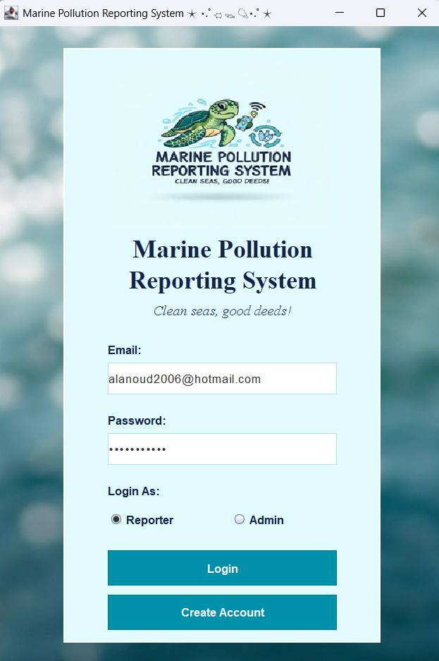
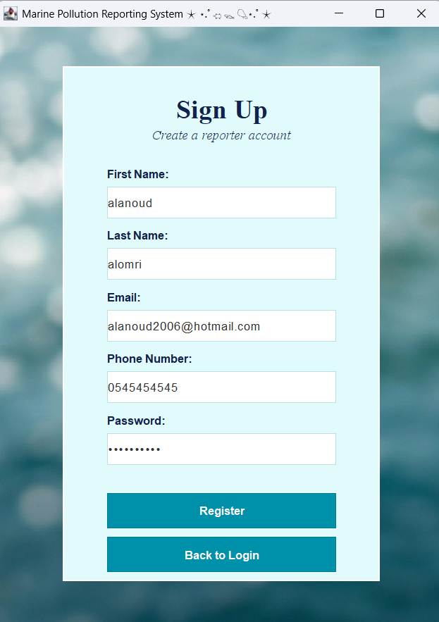
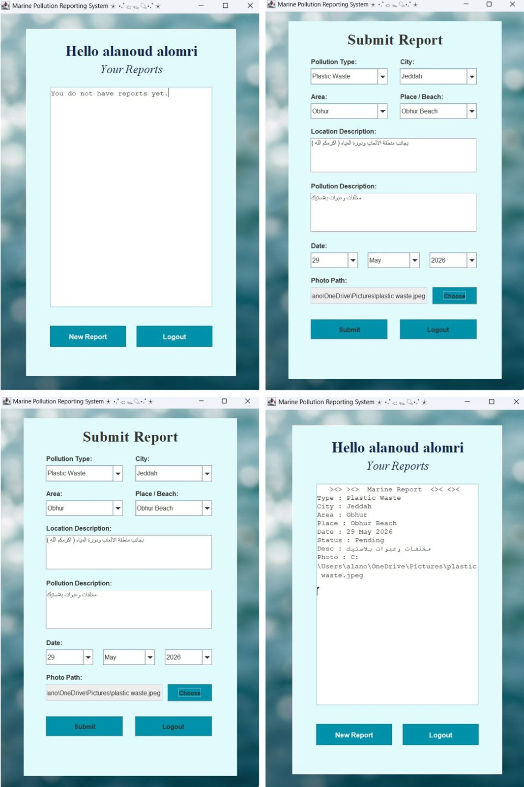
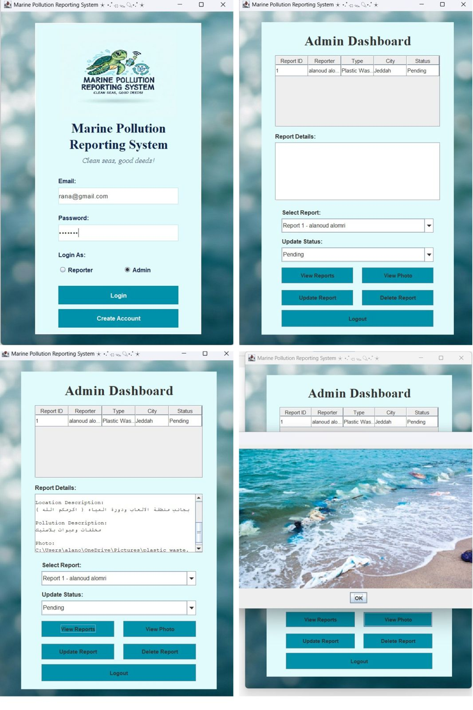

# Marine Pollution Reporting System

> A Java GUI application with database integration for reporting and managing marine pollution cases.

## Overview

The Marine Pollution Reporting System is a group project developed to provide a simple and organized way for users to report pollution cases in marine areas.

The application allows users to create an account, log in, submit detailed pollution reports, attach a photo, and review their submitted reports. It also includes an admin dashboard for reviewing reports, managing their status, viewing attached photos, and handling report records.

## Core Features

### Reporter Features

- Create a reporter account
- Log in as a reporter
- Submit marine pollution reports
- Select pollution type, city, area, and beach location
- Add location and pollution descriptions
- Attach a photo to a report
- View submitted reports and their current status

### Admin Features

- Log in through an admin portal
- View submitted pollution reports
- Review report details
- View attached pollution photos
- Update report status
- Delete reports when needed
- Export report information as a text file

## Database Integration

The application uses database integration to store and manage user accounts and pollution reports.

This allows reports to remain available after submission, appear in the reporter dashboard, and be managed through the admin dashboard.

## My Contribution

I worked on the user account functionality, including account registration, login, and validation for existing email addresses and phone numbers.

## Built With

- Java
- Java GUI
- Database Integration
- Object-Oriented Programming

## Project Workflow

1. A reporter creates an account or logs in.
2. The reporter submits a pollution report with location details, descriptions, date, and a photo.
3. The report is stored in the database.
4. The reporter can review submitted reports.
5. An admin can view, update, manage, or delete reports.

## Application Screens

### Login Screen

### Create Reporter Account

### Submit Report and Reporter Dashboard

### Admin Dashboard and Photo Viewer

## Project Type

Group project developed as part of a Computer Science course.

> The original source code, database files, and full project documentation are kept private.
